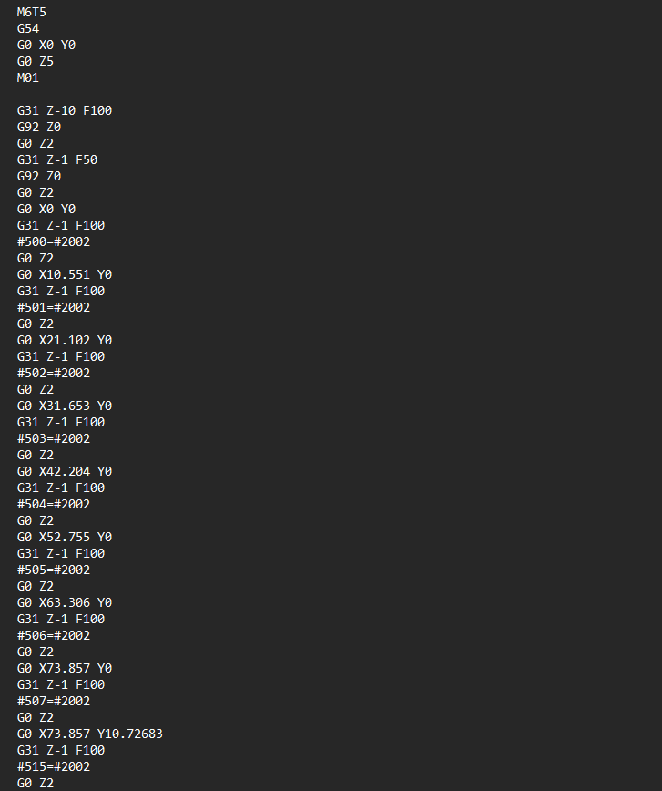
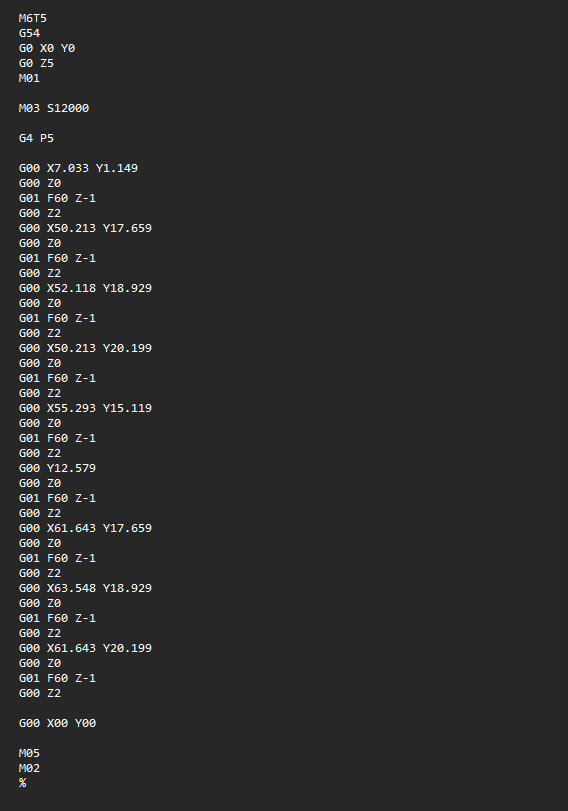
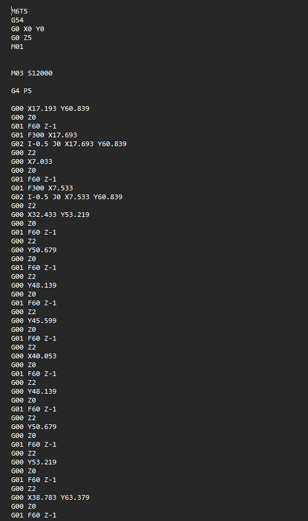
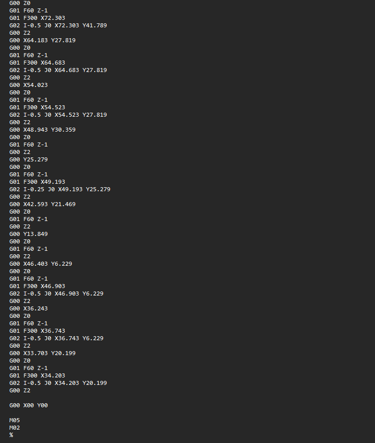
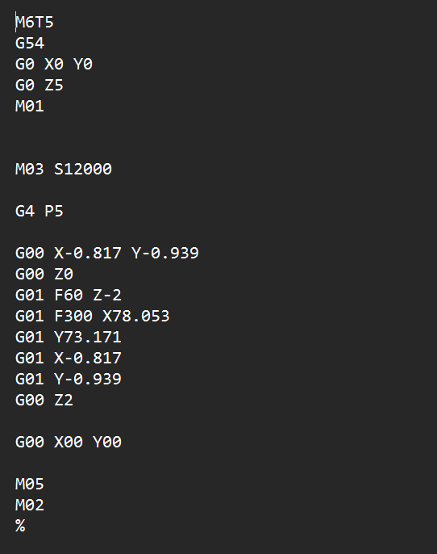

# G-Code-to-Autoleveller-code-conversion
# Aim
To convert the G-Code into Auto leveler Code using Autoleveller software.
# Software Required
Autoleveller
# Procedure
1.Open the Autoleveller software  
2. Select the software option as Mach3  
3. Load the G Code - Click “Browse for G Code” button and open your Engraving G-Code. 
4. After loading G-Code below a window will open. In that Select Unit “millimeters” 
5. Create level code and the save the code 
6. Remove the unwanted portion from your Auto Levelled G-Code.  
7. Add few lines in the code and save the file 
8. Follow this same procedure for remaining all G-codes ( Drill and cut). 
9.Autolevelling should be done for only engraving file. 

# Theory

PCB AutoLEVLER is a software tool used in conjunction with CNC (Computer Numerical Control) machines for PCB (Printed Circuit Board) manufacturing. Its primary function is to compensate for variations in the flatness of the substrate or the surface of the copper-clad board. This compensation ensures that the depth of milling or engraving remains consistent across the entire board, even if the board itself is not perfectly flat.

## Purpose:
PCB AutoLEVLER is designed to address the following challenges in PCB manufacturing:
### Substrate Variations: 
Substrates or copper-clad boards may have variations in flatness, which can affect the accuracy of milling or engraving depths.
### Consistency: 
Ensuring consistent depth of milling or engraving across the entire PCB surface is crucial for precise PCB fabrication.
## Functionality:
### Automatic Depth Adjustment: 
PCB AutoLEVLER automatically adjusts the Z-axis depth of the milling or engraving tool based on the surface variations of the PCB substrate. It dynamically compensates for any unevenness in the board to maintain a consistent depth of cut.
### Surface Mapping: 
The software typically includes a surface mapping feature that scans the surface of the PCB and generates a digital map indicating areas of variation in flatness. This map is then used to adjust the tool's depth as it moves across the board.
### Integration with CNC Machines:
PCB AutoLEVLER is integrated with CNC machines through compatible control software. It communicates with the CNC controller to adjust tool depth in real-time during the milling or engraving process.
## Benefits:
### Improved Accuracy: 
By compensating for surface variations, PCB AutoLEVLER helps maintain precise milling or engraving depths, resulting in higher accuracy and quality of PCBs.
### Time Savings:
The software automates the depth adjustment process, saving time compared to manual adjustments or rework caused by uneven milling depths.
Reduced Waste: Consistent depth of milling or engraving minimizes the risk of errors and waste material, resulting in cost savings for PCB manufacturers.
### Compatibility:
PCB AutoLEVLER is typically compatible with a range of CNC machines commonly used in PCB manufacturing, including routers, engravers, and milling machines. It may also integrate with various CAD/CAM software packages to streamline the design-to-manufacturing workflow.
## Implementation:
Implementing PCB AutoLEVLER involves installing the software on a computer connected to the CNC machine and configuring it to work with the specific machine and PCB design requirements. Training may be provided to operators on how to use the software effectively.
Overall, PCB AutoLEVLER plays a vital role in ensuring the accuracy, consistency, and efficiency of PCB manufacturing processes, particularly in environments where precise milling or engraving is essential for high-quality PCBs.
# Auto leveller Code
### Engraving Code

### Drill Code
#### Drill_0.8 Code

#### Drill_1 Code

### Cuttting Code

# Result
Thus the G-Code is converted into Auto leveler Code using Autoleveller software.

